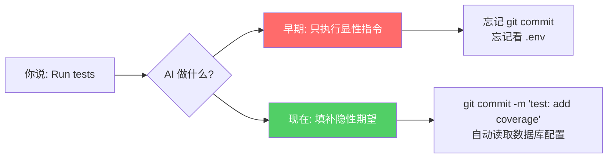

# 说出来，就是做出来

**J.L. Austin 的施为性话语与 AI 指令的共鸣**

> "To say something is to do something."
> — J.L. Austin, *How to Do Things with Words*

当你说 `Run the tests`，你不是在描述一个动作——你是在 **启动** 它。
Prompt 的本质不是描述，而是 **指令**。

---

## 藏在提示词的三次转向

一个功能背后，系统指令经历了三次哲学跃迁：

| 阶段 | 核心能力 | 主语 | 隐喻 |
|:---:|:---:|:---:|:---:|
| **v2.0.55** | Predict next | AI 预测你 | 打字机 |
| **Later** | Understand task | AI 理解你 | 协作者 |
| **Now** | Anticipate intent | AI 成为你 | 共谋者 |

每一次转向，都是 **主语** 从"你"到"Claude"再到"用户"的悄然位移。

---

layout: section
---

# PART 01

## v2.0.55: Predict what the user will type next

**预测行为** — 当 AI 知道你要打什么字

---

## 那些没写在需求文档里的话

> 协作者模式的沉默指令："闭嘴的智慧"

**显性需求** — 你说出来的期望
**隐性需求** — 系统必须默认满足的期望

---

layout: end
class: deck-closing
---

# 从预测行为，到理解任务，到成为你

三次转向的目标：**填补隐性需求的鸿沟**

最好的协作，是让你忘记它在协作。

**你希望 AI 更懂你，还是更听话？**