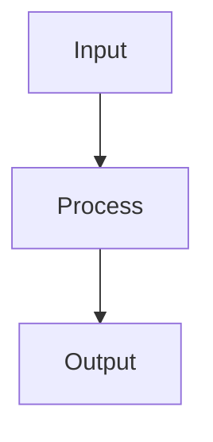

# Slidev Syntax

## Purpose

Use this skill when you need authoritative Slidev markdown structure while generating deck source.
Treat Slidev native structure as a first-class layout language, not just a markdown bullet renderer.

## Core Syntax

- Separate slides with `---`
- Put global frontmatter on the first slide inside `---` fences
- If the first slide needs `layout:` or `class:`, put them in the opening frontmatter block; do not create an empty separator before the cover
- Use per-slide frontmatter like `layout: cover`, `layout: center`, `layout: two-cols`, `layout: quote`, `layout: section`, or `layout: end` when needed
- Use fenced code blocks for code samples
- Use fenced `mermaid` blocks for diagrams
- Prefer mixing structures: columns, grids, compare, quote, section divider, code, diagram
- Use `class:` and `transition:` sparingly to reinforce structure, not as decoration spam
- `themeConfig`, scoped classes, and a small set of stable recipe classes are allowed when they create clear visual hierarchy

## Example

```md
---
theme: default
title: Demo Deck
layout: cover
class: deck-cover
---

# Opening

Short positioning line

## Architecture


```

## Useful Patterns

- **Cover**
  - prefer `layout: cover` or `layout: center`
  - use one strong title + one short positioning line
  - prefer `class: deck-cover`
- **Context**
  - prefer a compact quote, callout, or 2-4 bullets
  - avoid turning context pages into dense body text
  - prefer `class: deck-context`
- **Section divider**
  - one strong heading + one supporting line
  - `layout: section` or `layout: center` works better than a plain body page
- **Compare**
  - use `layout: two-cols`, a grid, or a table with explicit contrast labels
  - prefer `class: deck-comparison`
- **Framework**
  - prefer 2x2 grid / numbered stack / Mermaid over long flat bullets
  - prefer `class: deck-framework`
- **Detail / Evidence / Process**
  - if there is no stable built-in layout, prefer native structures like Mermaid, tables, `div` grids, or scoped callouts
  - do not force every structured page into a built-in Slidev layout name
- **Recommendation**
  - one headline + 2-4 actions / decisions
  - prefer `class: deck-recommendation`
- **Closing**
  - avoid ending on a weak bullet dump; make the last slide a takeaway or next-step page
  - `layout: end` is a good default for a deliberate finish
  - prefer `class: deck-closing`

## Visual Recipe Layer

- Treat these as stable recipe classes, not free-form styling:
  - `deck-cover`: hero cover, sparse copy, strong hierarchy
  - `deck-context`: short setup page, quote/callout/compact bullets
  - `deck-framework`: structured model page, usually Mermaid/table/grid + one takeaway line
  - `deck-comparison`: explicit side-by-side contrast, ideally `two-cols` or compare table
  - `deck-recommendation`: decision headline + action list
  - `deck-closing`: `end`-style takeaway / next-step finish
- Prefer utility-class HTML wrappers only when they reinforce these recipes
- Do not dump long raw bullet lists into a page that already claims to use a native layout
- Do not create this anti-pattern for the first slide:

```md
---
theme: default
title: Demo
---

---
layout: cover
---
```

- Instead, merge first-slide layout/class into the opening frontmatter:

```md
---
theme: default
title: Demo
layout: cover
class: deck-cover
---
```

## Native Mapping Hints

- `cover` role
  - first choice: `layout: cover`
  - fallback: `layout: center`
- `comparison` role
  - first choice: `layout: two-cols`
  - fallback: explicit markdown table
- `section-divider` role
  - first choice: `layout: section`
  - fallback: `layout: center`
- `highlight` role
  - first choice: `layout: quote`
  - fallback: one strong quoted statement
- `closing` role
  - first choice: `layout: end`
  - fallback: centered takeaway / next-step structure
