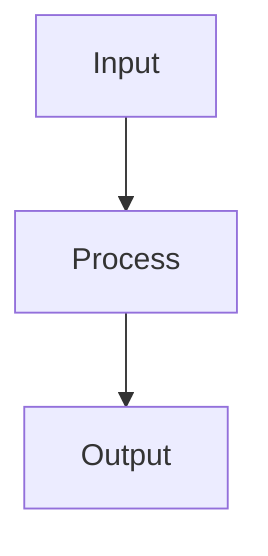

# Slidev Syntax

## Purpose

Use this skill when you need authoritative Slidev markdown structure while generating deck source.

## Core Syntax

- Separate slides with `---`
- Put global frontmatter on the first slide inside `---` fences
- Use fenced code blocks for code samples
- Use fenced `mermaid` blocks for diagrams
- Use layout directives such as `layout: center` in slide frontmatter when needed

## Example

```md
---
theme: default
title: Demo Deck
---

# Opening

---
layout: center
---

## Architecture


```
